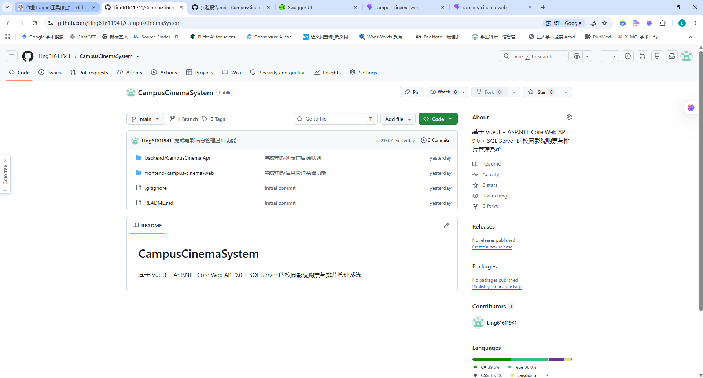
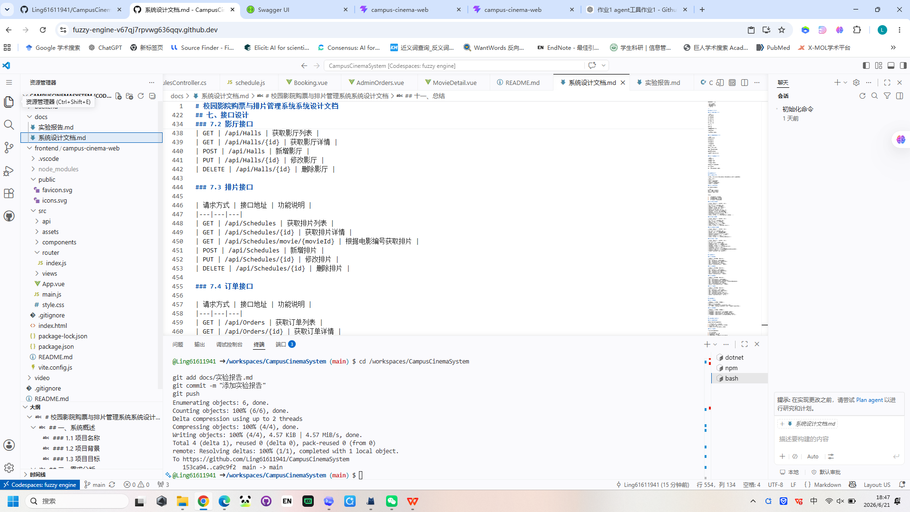
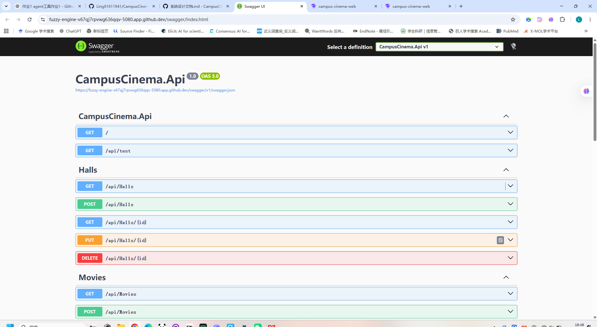
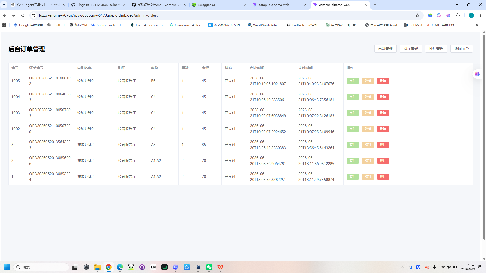
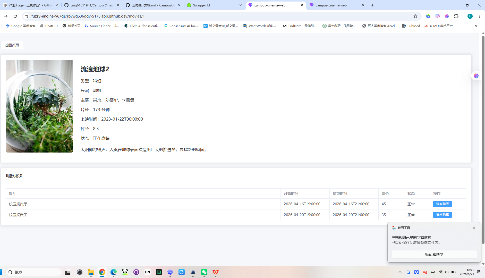
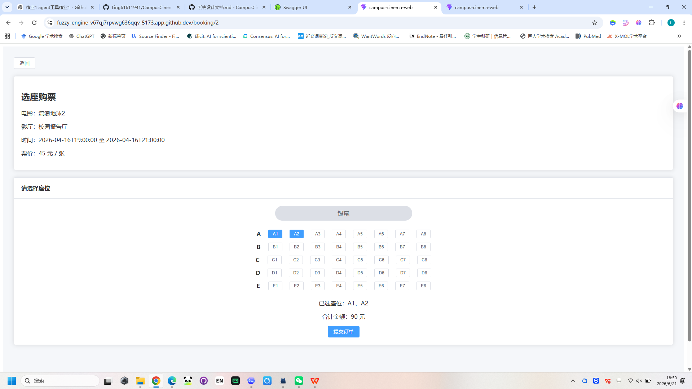
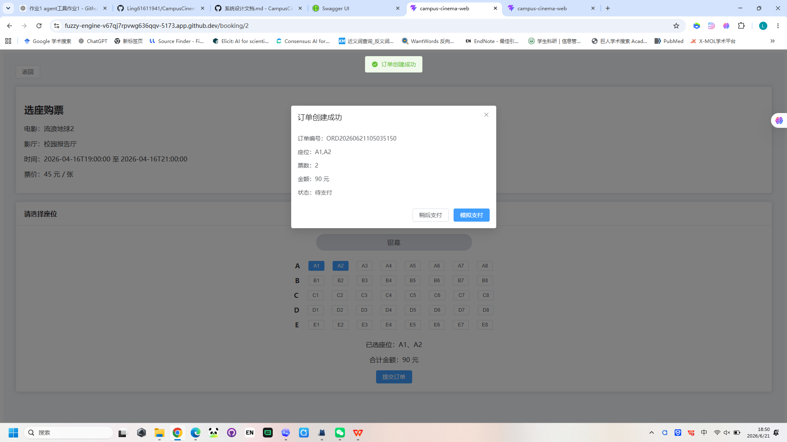
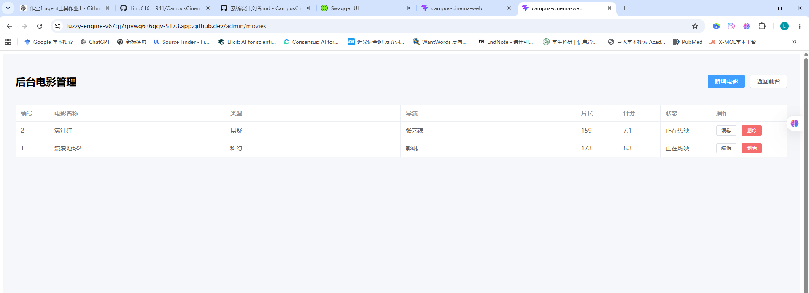
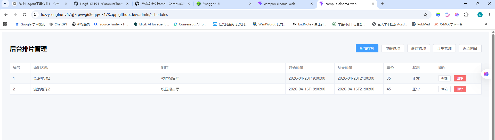
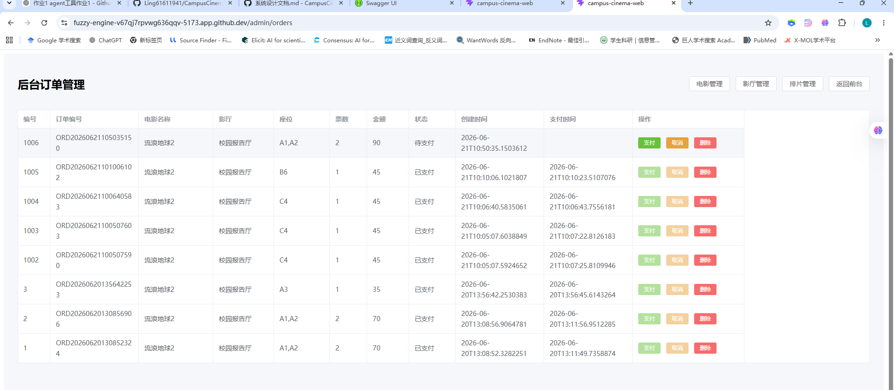

# 校园影院购票与排片管理系统实验报告

## 一、实验题目

校园影院购票与排片管理系统

---

## 二、实验目的

本实验的目的是综合运用《信息系统开发》课程中学习到的前端开发、后端接口开发、数据库设计和系统集成等知识，完成一个具有实际业务流程的信息管理系统。

通过本系统的开发，主要达到以下目的：

1. 掌握前后端分离项目的基本开发流程。
2. 掌握 Vue 3 前端页面开发方法。
3. 掌握 ASP.NET Core Web API 后端接口开发方法。
4. 掌握 SQL Server 数据库设计与 Entity Framework Core 数据访问方法。
5. 掌握前端通过 Axios 调用后端接口的方式。
6. 了解电影管理、影厅管理、排片管理和订单管理等业务流程。
7. 训练使用 GitHub 进行代码托管和版本管理的能力。

---

## 三、开发平台与软件选择

### 3.1 开发平台

本项目主要使用 GitHub Codespaces 作为在线开发环境。GitHub Codespaces 提供了云端 VS Code 开发环境，可以直接在浏览器中完成代码编写、运行、调试和提交。

### 3.2 开发工具

| 工具名称 | 用途 |
|---|---|
| GitHub Codespaces | 在线开发环境 |
| Visual Studio Code | 代码编辑 |
| Git / GitHub | 代码版本管理 |
| Docker | 运行 SQL Server 数据库 |
| Swagger | 后端接口测试 |
| 浏览器 | 前端页面测试 |

### 3.3 技术栈选择

| 层次 | 技术 | 说明 |
|---|---|---|
| 前端 | Vue 3 | 构建前端页面 |
| 前端构建工具 | Vite | 创建和运行 Vue 项目 |
| 前端 UI | Element Plus | 实现表格、表单、弹窗等组件 |
| 前端请求 | Axios | 调用后端 Web API |
| 前端路由 | Vue Router | 管理页面跳转 |
| 后端 | ASP.NET Core Web API 9.0 | 开发 RESTful 接口 |
| ORM | Entity Framework Core | 操作数据库 |
| 数据库 | SQL Server | 存储系统业务数据 |
| 接口测试 | Swagger | 测试后端接口 |

---

## 四、系统功能说明

本系统主要分为前台用户功能和后台管理功能。

---

### 4.1 前台用户功能

#### 4.1.1 电影列表展示

用户进入首页后，可以看到当前校园影院中的电影列表。每部电影展示电影名称、类型、导演、片长、评分和状态等信息。

#### 4.1.2 电影详情查看

用户点击电影卡片中的“查看详情”按钮后，可以进入电影详情页面，查看电影的详细介绍，并查看该电影对应的排片场次。

#### 4.1.3 场次查看

电影详情页展示该电影的排片信息，包括：

- 影厅
- 开始时间
- 结束时间
- 票价
- 排片状态

#### 4.1.4 选座购票

用户点击某个场次的“选座购票”按钮后，进入选座页面。页面显示电影、影厅、放映时间、票价和座位区域。用户可以选择 A1、A2 等座位，并提交订单。

#### 4.1.5 模拟支付

订单创建成功后，系统弹出订单信息。用户可以选择“模拟支付”，系统会调用支付接口，将订单状态从“待支付”修改为“已支付”。

---

### 4.2 后台管理功能

#### 4.2.1 电影管理

管理员可以进入电影管理页面，对电影信息进行新增、编辑、删除和查看。

电影管理字段包括：

- 电影名称
- 类型
- 导演
- 主演
- 简介
- 海报地址
- 片长
- 上映日期
- 评分
- 状态

#### 4.2.2 影厅管理

管理员可以进入影厅管理页面，对影厅信息进行新增、编辑、删除和查看。

影厅管理字段包括：

- 影厅名称
- 座位行数
- 座位列数
- 影厅类型
- 状态

#### 4.2.3 排片管理

管理员可以进入排片管理页面，为电影安排放映场次。

排片管理字段包括：

- 电影
- 影厅
- 开始时间
- 结束时间
- 票价
- 状态

系统在新增或修改排片时，会校验同一影厅在相同时间段内是否存在排片冲突。

#### 4.2.4 订单管理

管理员可以进入订单管理页面查看订单列表，并可以对订单进行支付、取消和删除操作。

订单管理字段包括：

- 订单编号
- 电影名称
- 影厅
- 座位
- 票数
- 总金额
- 状态
- 创建时间
- 支付时间

---

## 五、系统运行流程

系统的核心业务流程如下：

```text
管理员维护电影信息
        ↓
管理员维护影厅信息
        ↓
管理员创建电影排片
        ↓
用户浏览电影列表
        ↓
用户查看电影详情和排片
        ↓
用户选择场次并选座
        ↓
系统生成订单
        ↓
用户模拟支付或稍后支付
        ↓
管理员在后台查看和管理订单
```

---

## 六、数据库设计说明

本系统使用 SQL Server 数据库，主要包含四张核心业务表。

### 6.1 Movie 电影表

用于保存电影基础信息。

| 字段名 | 说明 |
|---|---|
| Id | 电影编号 |
| Name | 电影名称 |
| Category | 电影类型 |
| Director | 导演 |
| Actors | 主演 |
| Description | 简介 |
| PosterUrl | 海报地址 |
| Duration | 片长 |
| ReleaseDate | 上映日期 |
| Score | 评分 |
| Status | 状态 |

### 6.2 Hall 影厅表

用于保存校园影院影厅信息。

| 字段名 | 说明 |
|---|---|
| Id | 影厅编号 |
| Name | 影厅名称 |
| RowCount | 座位行数 |
| ColumnCount | 座位列数 |
| Type | 影厅类型 |
| Status | 状态 |

### 6.3 Schedule 排片表

用于保存电影排片信息。

| 字段名 | 说明 |
|---|---|
| Id | 排片编号 |
| MovieId | 电影编号 |
| HallId | 影厅编号 |
| StartTime | 开始时间 |
| EndTime | 结束时间 |
| Price | 票价 |
| Status | 状态 |

### 6.4 Order 订单表

用于保存用户购票订单信息。

| 字段名 | 说明 |
|---|---|
| Id | 订单编号 |
| OrderNo | 订单号 |
| ScheduleId | 排片编号 |
| UserName | 用户名 |
| SeatCodes | 座位编号 |
| TicketCount | 票数 |
| TotalAmount | 总金额 |
| Status | 订单状态 |
| CreatedAt | 创建时间 |
| PaidAt | 支付时间 |

---

## 七、系统接口说明

### 7.1 电影接口

| 请求方式 | 接口地址 | 说明 |
|---|---|---|
| GET | /api/Movies | 获取电影列表 |
| GET | /api/Movies/{id} | 获取电影详情 |
| POST | /api/Movies | 新增电影 |
| PUT | /api/Movies/{id} | 修改电影 |
| DELETE | /api/Movies/{id} | 删除电影 |

### 7.2 影厅接口

| 请求方式 | 接口地址 | 说明 |
|---|---|---|
| GET | /api/Halls | 获取影厅列表 |
| GET | /api/Halls/{id} | 获取影厅详情 |
| POST | /api/Halls | 新增影厅 |
| PUT | /api/Halls/{id} | 修改影厅 |
| DELETE | /api/Halls/{id} | 删除影厅 |

### 7.3 排片接口

| 请求方式 | 接口地址 | 说明 |
|---|---|---|
| GET | /api/Schedules | 获取排片列表 |
| GET | /api/Schedules/{id} | 获取排片详情 |
| GET | /api/Schedules/movie/{movieId} | 根据电影获取排片 |
| POST | /api/Schedules | 新增排片 |
| PUT | /api/Schedules/{id} | 修改排片 |
| DELETE | /api/Schedules/{id} | 删除排片 |

### 7.4 订单接口

| 请求方式 | 接口地址 | 说明 |
|---|---|---|
| GET | /api/Orders | 获取订单列表 |
| GET | /api/Orders/{id} | 获取订单详情 |
| POST | /api/Orders | 创建订单 |
| PUT | /api/Orders/{id}/pay | 支付订单 |
| PUT | /api/Orders/{id}/cancel | 取消订单 |
| DELETE | /api/Orders/{id} | 删除订单 |

---

## 八、系统运行截图说明

## 八、系统运行截图说明

### 8.1 GitHub 仓库页面



该截图展示了项目 GitHub 仓库，包括 backend、frontend、docs 和 README.md 等目录，证明项目已完成代码托管。

---

### 8.2 Codespaces 项目结构



该截图展示了项目在 GitHub Codespaces 中的目录结构，包括后端项目、前端项目和文档目录。

---

### 8.3 Swagger 接口页面



该截图展示了后端 Swagger 接口页面，包括 Movies、Halls、Schedules 和 Orders 等接口分组。

---

### 8.4 系统首页



该截图展示了校园影院购票与排片管理系统首页，用户可以查看电影列表并进入电影详情页。

---

### 8.5 电影详情页



该截图展示了电影详情和排片场次信息，包括影厅、开始时间、结束时间、票价和选座购票按钮。

---

### 8.6 选座购票页



该截图展示了用户选座购票页面，用户可以选择座位并查看合计金额。

---

### 8.7 订单创建成功弹窗



该截图展示了订单创建成功后的弹窗，包括订单编号、座位、票数、金额和订单状态。

---

### 8.8 后台电影管理页



该截图展示了后台电影管理功能，管理员可以新增、编辑和删除电影信息。

---

### 8.9 后台排片管理页



该截图展示了后台排片管理功能，管理员可以新增、编辑和删除电影排片。

---

### 8.10 后台订单管理页



该截图展示了后台订单管理功能，管理员可以查看订单，并对订单进行支付、取消和删除操作。


---

## 九、开发过程中遇到的问题及解决方案

### 9.1 前后端跨域问题

问题描述：

前端 Vue 项目运行在 5173 端口，后端 Web API 运行在 5080 端口，前端请求后端接口时可能出现跨域访问失败。

解决方案：

在后端 `Program.cs` 中配置 CORS 策略，允许前端访问后端接口。

### 9.2 SQL Server 连接问题

问题描述：

后端接口在访问数据库时，如果 SQL Server 容器没有启动，会导致接口无法正常返回数据。

解决方案：

使用 Docker 启动 SQL Server 容器：

```bash
docker start campus-cinema-sqlserver
```

并确认后端连接字符串配置正确。

### 9.3 Entity Framework 数据库迁移问题

问题描述：

新增 Hall、Schedule、Order 等实体后，数据库中没有对应表，导致接口访问失败。

解决方案：

使用 EF Core 迁移命令生成数据库表：

```bash
dotnet ef migrations add AddScheduleTable
dotnet ef database update
```

### 9.4 前端路由跳转问题

问题描述：

点击“选座购票”按钮后无法跳转到选座页面。

解决方案：

检查 Vue Router 配置是否添加了 `/booking/:scheduleId` 路由，并检查按钮点击事件是否正确传入排片 id。

### 9.5 排片冲突问题

问题描述：

同一个影厅在同一时间段可能被重复安排不同电影场次。

解决方案：

在后端新增和修改排片时增加时间冲突判断逻辑，判断同一影厅已有排片是否与新排片时间重叠。

### 9.6 订单支付按钮不可点击问题

问题描述：

订单管理页面中，有些订单的“支付”和“取消”按钮不可点击。

解决方案：

系统设置只有“待支付”状态的订单才能支付或取消。如果订单已经是“已支付”，按钮禁用是正常情况。

---

## 十、AI 使用情况说明

在本项目开发过程中，合理使用了 AI 工具辅助完成系统开发。AI 主要用于以下方面：

1. 辅助分析课程作业要求。
2. 辅助拆分系统功能模块。
3. 辅助设计前后端项目结构。
4. 辅助生成部分基础代码。
5. 辅助分析报错信息并给出修改建议。
6. 辅助整理 README、系统设计文档和实验报告。

在使用 AI 的过程中，并不是直接复制后即完成，而是结合实际运行结果进行人工测试、修改和验证。系统中的电影管理、影厅管理、排片管理、选座购票和订单管理等功能均经过实际运行测试。

---

## 十一、实验总结

通过本次课程大作业，我完整体验了一个前后端分离信息系统的开发过程。从最开始的需求分析、数据库设计，到后端 Web API 接口开发，再到 Vue 前端页面实现，最后完成前后端联调和 GitHub 代码提交，整个过程让我对信息系统开发有了更加完整的认识。

在开发过程中，我学习到了 Vue 3、Vue Router、Axios、Element Plus、ASP.NET Core Web API、Entity Framework Core 和 SQL Server 等技术的基本使用方法。同时，也进一步理解了系统开发中需求分析、模块拆分、接口设计、数据库设计和测试调试的重要性。

本系统目前已经实现了校园影院购票与排片管理的主要功能，包括电影管理、影厅管理、排片管理、选座购票、模拟支付和订单管理等。虽然系统仍然可以继续扩展用户登录、真实支付、座位锁定和权限控制等功能，但作为课程大作业，本系统已经完成了主要业务流程，达到了实验目标。